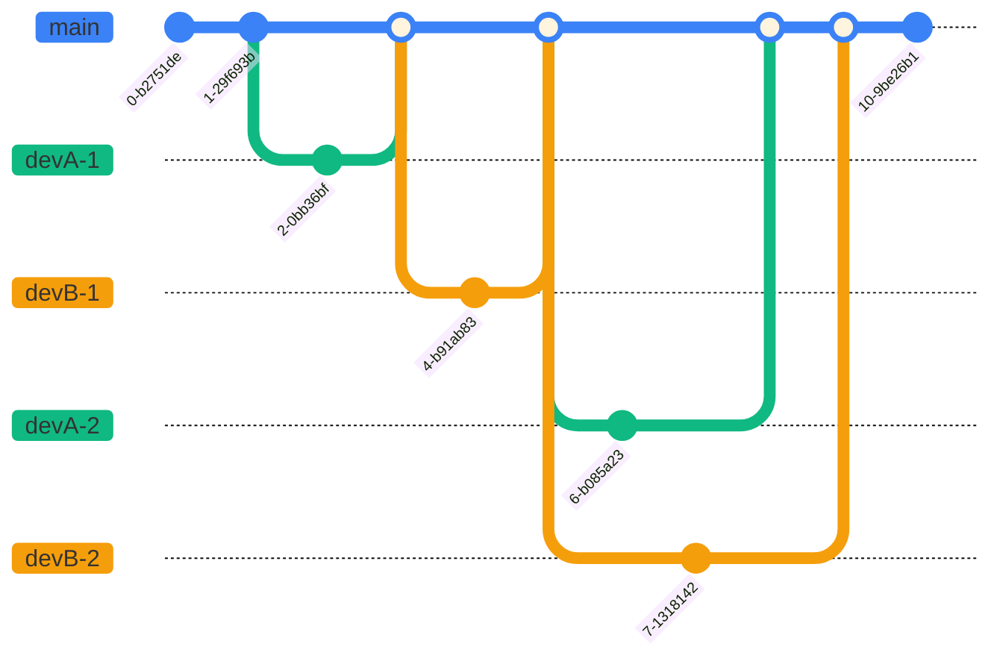

# Git Branching Strategies

## Trunk-based Development

At its most simple, trunk-based development consists of a single branch (`main`) where all developers commit their changes on an ongoing basis. This approach emphasizes continuous integration and frequent commits to the main branch, which can lead to faster feedback and quicker releases.

### Example Trunk-Based Development Workflow

In the example below, the commits from two developers (Dev A and Dev B) are merged directly into the `main` branch. Pull requests are not used, and the focus is on continuous integration and frequent commits to the main branch.

### Trunk-Based Development Downsides

While trunk-based development can lead to faster feedback and quicker releases, it can also lead to issues with code quality if not managed properly. Without pull requests and code reviews, it can be easier for bugs and issues to be introduced into the main branch, which can impact the overall quality of the codebase. Additionally, if multiple developers are working on different features in parallel, it can lead to conflicts and merge issues when changes are merged into the main branch.

## GitHub Flow (Feature Branching with Pull Requests)

GitHub Flow is a simple branching strategy based on Trunk-based Development, but with the addition of pull requests for code review and collaboration. In GitHub Flow, developers create feature branches off of the main branch, work on their changes, and then open a pull request to merge their changes back into the main branch. This allows for code review and discussion before changes are merged, which can help improve code quality and catch issues early.

> This is the approach currently in use in Cohort Manager, and is *mostly* a good fit as it provides a simple branching strategy while still incorporating code review and collaboration opportunities.

### Example GitHub Flow Workflow

In the example below, developers create **feature branches** off of the `main` branch, work on their changes, and then open pull requests to merge their changes back into the `main` branch. This allows for code review and discussion before changes are merged.

### GitHub Flow Downsides

While GitHub Flow provides a simple and effective branching strategy, it is not an ideal option when multiple developers are working on different features in parallel as it can lead to a large number of feature branches and pull requests.

Additionally, if pull requests are not reviewed and merged in a timely manner (for instance while assurance processes are undertaken), it can lead to long-lived branches that diverge significantly from the `main` branch, making merging more difficult and increasing the risk of conflicts.

## Git Flow

Git Flow is a more structured branching strategy that defines specific branches for different purposes, such as development, releases, and hotfixes. It provides a clear workflow particularly suited to teams with multiple developers working on different features in parallel and with fixed release cycles.

### Example Git Flow Workflow

In the example below, developers create **feature branches** off the `develop` branch, work on their changes, and then open pull requests to merge their changes back into the `develop` branch. When a release is ready, a `release` branch is created from `develop`, and once the release is deployed, it is merged back into both `main` and `develop`.

If a hotfix is required before the next release, a `hotfix` branch is created from `main`, the fix is made, and then the hotfix branch is merged back into both `main` and `develop` to ensure the fix is included in future releases.

### Git Flow Downsides

Due to its branch complexity, Git Flow can be more difficult to manage and may require more overhead in terms of branch management and merging.

In Cohort Manager, we would also need to consider how Git Flow would fit in with our current CI/CD pipeline, particularly on how container images are built and the ability to push un-merged changes to Azure via the DevTest workflow, and whether accommodating these factors would require significant changes to our existing processes.

## Recommended Alternative: GitHub Flow with Release Branches

An alternative approach that combines elements of both GitHub Flow and Git Flow is to use GitHub Flow for feature development and pull requests, but also incorporate release branches to provide a backstop for releases and allow for hotfixes if needed. This approach allows for the simplicity and collaboration of GitHub Flow while also providing the structure and stability of release branches.

Adopting it would require the least amount of change from exiting merging patterns, and also allow us to maintain our existing CI/CD pipeline with minimal changes, while still providing the benefits of release branches for managing releases and hotfixes.

### Example GitHub Flow with Release Branches Workflow

In the example below, developers create **feature branches** off the `main` branch, work on their changes, and then open pull requests to merge their changes back into the `main` branch. When one or more PRs are ready for release, a `release` branch is created from `main` to act as a backstop in case changes need to be pulled out of the release, or hotfixes are needed while the release is in progress. The release branch does not need to be merged back into `main` as the release branch is created from `main` and only contains changes that have already been merged into `main`.

### Applying Hotfixes to Main or a Release Branch

If a hotfix is required before the next release, a `hotfix` branch can be created from `main`, the fix can be made, and then the hotfix branch can be merged back into `main` to ensure the fix is included in future releases.

If, however, a hotfix/bugfix is needed while a release is in progress, a hotfix branch can be created from the release branch, the fix can be made, and then the hotfix branch can be merged back into the release branch to ensure the fix is included in the release. Once the release is complete, the hotfix branch can then be merged back into `main` to ensure the fix is included in future releases.

Imagine the case where the following sequence of events occurs:

## Applying GitHub Flow with Release Branches in Cohort Manager

The model described above would be used as follows within the Cohort Manager project:

1. Developers create **feature** branches off the `main` branch for their work and open pull requests to merge their changes back into `main` when conditions allow.
1. As and when a given PR is approved for inclusion in the next release, it is merged into `main`.
1. When one or more PRs are ready for release, the build at that point in time can be completed and pushed through to production.
1. A `release` branch is then created from `main` before any other changes are merged into it in case hotfixes are needed once further PRs have been merged to `main`. The release branch would not need to be merged back into `main` as the release branch is created from `main` and only contains changes that have already been merged into `main`.
1. If a hotfix is required ***before*** new changes have been merged to `main`, a `hotfix` **feature** branch can be created from `main`, the fix can be made, and the hotfix branch can be merged back into `main` via a regular PR to ensure the fix is included in future releases. The build can then be completed and pushed through to production using the standard CI/CD workflow.
1. If a hotfix is required ***after*** new changes have been merged to `main` since the last release, a `hotfix` branch can be created from the latest **release** branch, the fix can be made, and then the hotfix branch can be merged back into the **release** branch via a PR. The build can then be completed and pushed through to production using the **DevTest** CI/CD workflow. Once the release is complete, the hotfix changes can then be merged back into `main` to ensure the fix is included in future releases.
