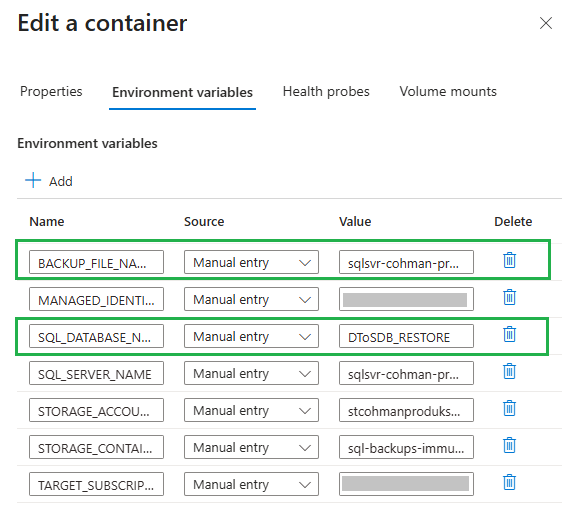
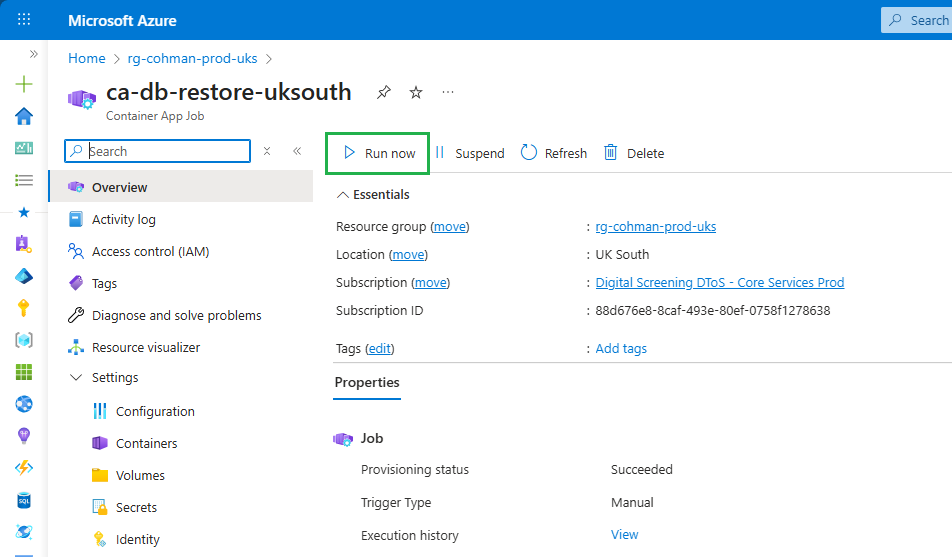
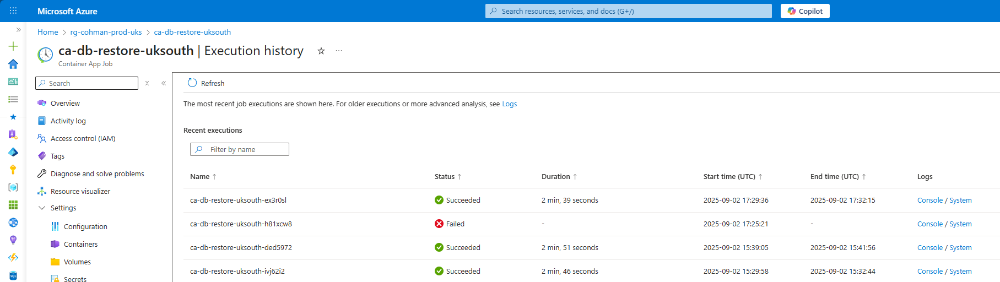

# Immutable Backups in Cohort Manager

This document provides an overview of the immutable backup strategy implemented in the Cohort Manager application. Immutable backups are crucial for ensuring data integrity and security, especially in environments where data is sensitive and must be protected against accidental or malicious alterations.

They are designed to be unchangeable and tamper-proof, providing a reliable way to restore data to a previous state if necessary, and take the place of the "One Off-Site" backup in the 3-2-1 backup strategy (Three copies of the data; Two separate media/types; One Off-Site).

## Immutable Storage Containers

Immutable backups in Cohort Manager are stored in Azure Blob Storage containers with immutability policies applied. These policies ensure that once data is written to the container, it cannot be modified or deleted for a specified retention period.

## Backup Process

A Container App Job (`ca-db-backup-uksouth`) has been deployed via the standard Infrastructure deployment pipelines into the Production environment. This runs a PowerShell script to create a SQL `bacpac` backup file via the well-supported Microsoft `SQLPackage` utility.

Once created, this backup file is pushed to a Storage Account in the Audit subscription dedicated to this purpose and with the Immutability Policy applied to the target storage container.

An Azure Devops pipeline ([Immutable Backup Task - Prod](https://dev.azure.com/nhse-dtos/dtos-cohort-manager/_build?definitionId=106)) has been created to run the container job at 02:00 UTC daily. This pipeline can be manually run on an ad-hoc basis to create additional backups if required.

## Restore Process

A Container App Job (`ca-db-restore-uksouth`) has been deployed alongside the backup job described above that runs a similar PowerShell script to download a specified backup copy and restore it as a new copy of the Cohort Manager database.

This can simply be run when required via the Azure Portal:

1. Set the required backup parameters by modifying the default Environment Variables for the Container App Job:

   

* Set `BACKUP_FILE_NAME` to the name of the stored backup file as seen in the storage container (including the `.bacpac` file extension)
* Optionally set `SQL_DATABASE_NAME` to the name of the new target database name (this defaults to `DToSDB_RESTORE`)
Run the job:

    

1. Check progress:

    

* Use the Console Logs link to view the job output logs, which will help confirm the successes of the job (though there is a large amount of error handling within the script so any failures should cause the whole job to fail), and to help identify the cause of any failures.

1. Once the backup has been restored as a copy of the original database, the steps described in the Confluence documentation to [Rename, Reset Retention Policies and Scale Down](https://nhsd-confluence.digital.nhs.uk/spaces/DTS/pages/1018845935/Azure+SQL+Database+Restore+Process) the Replaced Database must be followed to complete the full restore process.

## Managed Identities and Permissions

Two User Assigned Managed Identities have been created in the Production environment (via Terraform) to run the Container App Jobs for the Backup and the Restore processes:

* `mi-prod-uks-cohman-db-backup`
* `mi-prod-uks-cohman-db-restore`

These identities have been granted the necessary permissions to access the SQL Database and the Storage Account where the backups are stored via Azure RBAC role assignments in the Terraform code that deploys the Azure SQL database.

The identities must then also be added to the `sqlsvr_cohman_prod_uks_admin` Entra Id group that is used as the SQL Server admin account to allow them to connect to the database and perform the required operations. This must be done via the Azure Portal as it is not currently possible to manage group membership via Terraform.

## Container Images

The Docker images for the Container App Jobs that carry out the Backup and the Restore are built and pushed to the Azure Container Registry via a pair of bash scripts located in the scripts directory:

* [../../scripts/backups/db-backup-container/build.sh](../../scripts/backups/db-backup-container/build.sh)
* [../../scripts/backups/db-restore-container/build.sh](../../scripts/backups/db-restore-container/build.sh)

These scripts are run manually as required to build and push new versions of the container images, though this is not expected to be a frequent requirement as the scripts themselves are not expected to change often.
