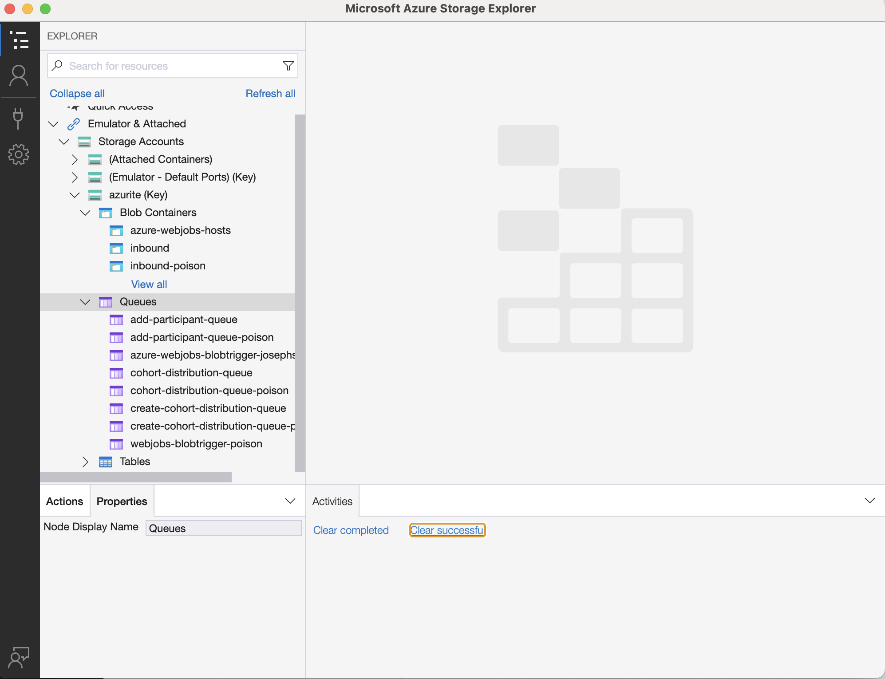

# Cohort Manager

## Prerequisites

- Visual Studio Code - VS Code is the chosen editor for the project due to VS for Mac being retired
- Git
- HomeBrew (Mac Only): \
    `/bin/bash -c "$(curl -fsSL https://raw.githubusercontent.com/Homebrew/install/master/install.sh)"`
- [.NET SDK (8.0)](https://dotnet.microsoft.com/en-us/download/dotnet/8.0)
- Member of the NHSDigital GitHub organisation
- Signed Git commits (if you would like to contribute): <https://github.com/NHSDigital/software-engineering-quality-framework/blob/main/practices/guides/commit-signing.md>

## Set-up

### 1. Import the NHS DToS Profile

To easily install the required extensions and settings/configuration for VS Code, you can import the profile located in `Set-up/NHS_DToS.code-profile`

On the top toolbar of Visual Studio Code go to *Code > Settings > Profiles > Import Profile > click on Select File...* and select the file **NHS_DToS.code-profile**

### 2. Azure Functions Core Tools

Azure Function Core Tools lets you develop and test your functions on your local computer. To install, press `ctrl/ command + shift + P` and enter `Azure Functions: Install or Update Azure Functions Core Tools`

### 3. Azure Data Studio & Storage Explorer

Azure Data Studio & Storage Explorer are the GUI tools we are using to manually interact with the database & Azure Storage respectively.

- Install [Azure Data Studio](https://learn.microsoft.com/en-us/azure-data-studio/download-azure-data-studio?tabs=wi[…]all%2Credhat-install%2Cwindows-uninstall%2Credhat-uninstall)
- (Optional) Install [Azure Storage Explorer](https://azure.microsoft.com/en-gb/products/storage/storage-explorer)

Use the **Intel Chip/ x64** installer if you have and Intel Chip in your Mac. Otherwise, use the **Apple Silicon/ ARM64** installer.

*Note: to check which version you are using, you can click on the Apple icon of your machine > About this Mac and a new window will appear. You can see the Chip your machine. Intel will have Intel in it, Apple Silicon will have something like Apple M1.*

## Running the Application Locally (Windows)
Dowload docker engine using [these instructions](https://medium.com/@rom.bruyere/docker-and-wsl2-without-docker-desktop-f529d15d9398)

First, copy the .env.example file, rename it to just ".env", enter a password that meets the security requirements, and enter the azurite connection string 

To run the system locally, in the CohortManager directory, run `docker compose up`, this will run all of the functions.

Other useful commands:

```bash
docker compose down    # Stop the functions
docker compose up/ down <service-name>   # Start a particular function or dependency

# Example:
docker compose up receive-caas-file

docker ps -a   # List all of the containers
docker logs <container-name>   # View the logs of the container
```

*Note anything in local.settings.json will not apply to the containerised functions

Alternatively, you can run an individual function locally with `func start`
## Running the Application Locally (Mac)
The full containerised solution does not work on Macs so you will have to run the application manually, but you can run the dependencies with docker
### Dependencies
Download colima using [these instructions](https://smallsharpsoftwaretools.com/tutorials/use-colima-to-run-docker-containers-on-macos/)

Add the environment variables using the instructions in the windows setup

You can then run and setup the dependencies using docker:
    `docker compose up azurite-setup db-setup`

### Functions
*Someone using a Mac please update this with instructions

## Appendix A: Storage
### The send-sample-file.py script
There is a script in `application/CohortManager/Set-up/azurite` that alllows you to send sample files to azurite.

Before your run the script you must download the sample files from confluence (you can see which files you need to download by running the command without arguments) run the following command: `pip install azure-storage-blob python-dotenv`

Run the file without arguments (`pyhton send-sample-file.py`) to see the help page

### Set-up Azure Storage Explorer
Alternatively, you can use the storage explorer to send files to azurite

Open the Azure Storage Explorer and in the Explorer, you will see **Azurite (Key)**. Expand that and you will see 1) Blob Container 2) Queues and 3) Tables. Right click on the **Blob Container** and click on **Create Blob Container**.

On Azure Storage Explorer, collapse **Emulator & Attached > Storage Accounts > Azurite (Key)** and right click on **Blob containers** and select Create Blob Container and type in `inbound` to create a container with that name.



Once created, use the sample csv files upload it to that new inbound container.

Back in VS Code you should see the logs of the functions running locally, once it's complete, you can refresh the database again to see the changes made by the CSV files.

*Note: Sample Data and Scripts to create the database are provided by the Data team. The latest files can be found in the `dtos-data-modes` repository in the NHS Digital GitHub <https://github.com/NHSDigital/dtos-data-models>
