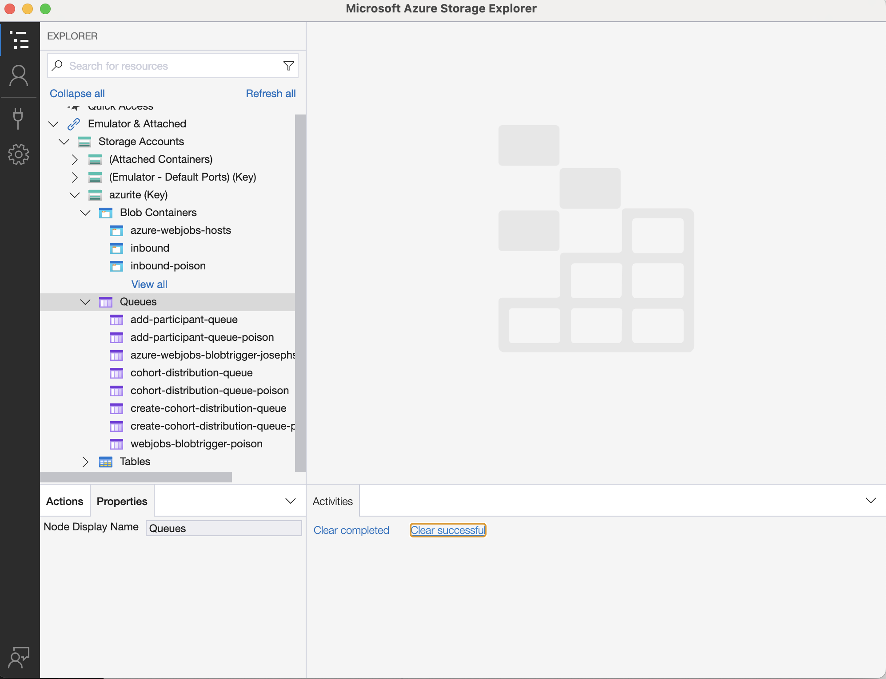

# User Guide

## Running the Application

The docker compose has now been split into 4 files due to the size of the application being too large to build in one go. There are now 4 files:

- compose.deps.yaml - contains the database, azurite and setup containers, this must be run before the other files
- compose.core.yaml - contains the core functions
- compose.cohort-distribution.yaml - cohort distribution
- compose.data-services.yaml - contains the data services
- compose.yaml - imports the core, cohort distribution, and data services files so they can be interacted with together

Several vscode tasks have been made for common docker operations for Windows and Mac, which you can access by pressing ctrl/ cmd + shift + p entering the command Tasks: Run Task, and searching for the appropriate task.

**For most development work, use the "Restart application" task.** This runs the core application services needed for development and testing.

**For testing that requires all services including non-essential ones, use the "Restart whole application (incl. non-essential services)" task.**

You can also download the "Tasks" extension in vscode to quickly run these task from the status bar.

To build and run the application manually in the terminal **(not recommended**), run the following commands in the application/CohortManager directory:\
If you are on Mac, you will need to replace `docker` with `podman`

```bash
# Build the functions
docker compose -f compose.core.yaml build
docker compose -f compose.cohort-distribution.yaml build
docker compose -f compose.data-services.yaml build

docker compose -f compose.deps.yaml up --build -d # Run the deps before the rest of the functions
docker compose up # Run the functions
```

>**Note:** This will take a while the first time

You should run `docker system prune` every once in a while to clear up unused docker objects that take up space

Other useful commands:

```bash
docker compose down    # Stop the functions
docker compose up/ down <service-name>   # Start a particular function or dependency

# Example:
docker compose up receive-caas-file

docker ps -a   # List all of the containers
docker logs <container-name>   # View the logs of the container
```

Alternatively, you can run an individual function locally with `func start`

### Profiles

To make the application more manageable to run, some functions have had [docker compose profiles](https://docs.docker.com/compose/how-tos/profiles/) added to them, which means they will not build and run unless specified

Key of profiles:

- bs-select - Functions that are only used by external requests from BS Select
- ui - only used by the user interface
- service-now - Functions that are only used in manual service now adds
- nems - Functions that are only used in NEMS requests
- non-essential - Functions that are not needed to run the application
- not-implemented - Functions that do not yet have an implementation and are not in use

You can run a specific profile with `docker compose --profile <profile-name> up`

Or, to run the whole application `docker compose --profile "*" up`

## Appendix A: Storage

### The send-sample-file.py script

There is a script in `application/CohortManager/Set-up/azurite` that alllows you to send sample files to azurite.

Before you run the script you must install the dependencies by running the following command: `pip install azure-storage-blob python-dotenv`

Run the file without arguments (`python send_sample_file.py`) to see the full instructions

### Set-up Azure Storage Explorer

Alternatively, you can use the storage explorer to send files to azurite

Open the Azure Storage Explorer and in the Explorer, you will see **Azurite (Key)**. Expand that and you will see 1) Blob Container 2) Queues and 3) Tables. Right click on the **Blob Container** and click on **Create Blob Container**.

On Azure Storage Explorer, collapse **Emulator & Attached > Storage Accounts > Azurite (Key)** and right click on **Blob containers** and select Create Blob Container and type in `inbound` to create a container with that name.



Once created, use the sample csv files upload it to that new inbound container.

Back in VS Code you should see the logs of the functions running locally, once it's complete, you can refresh the database again to see the changes made by the CSV files.

*Note: Sample Data and Scripts to create the database are provided by the Data team. The latest files can be found in the `dtos-data-modes` repository in the NHS Digital GitHub <https://github.com/NHSDigital/dtos-data-models>

