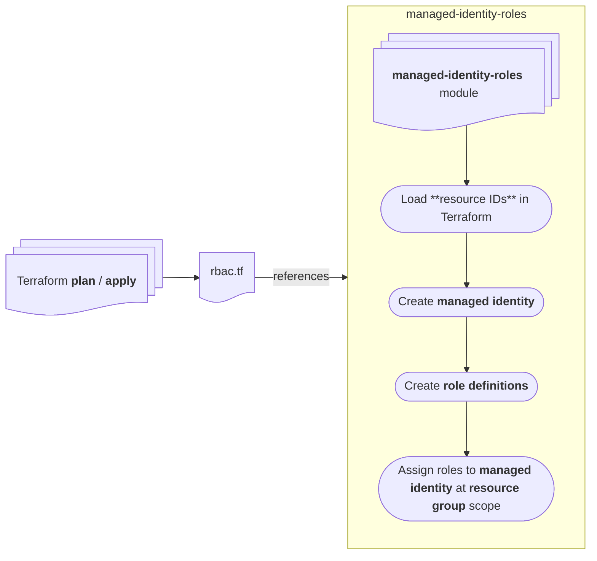
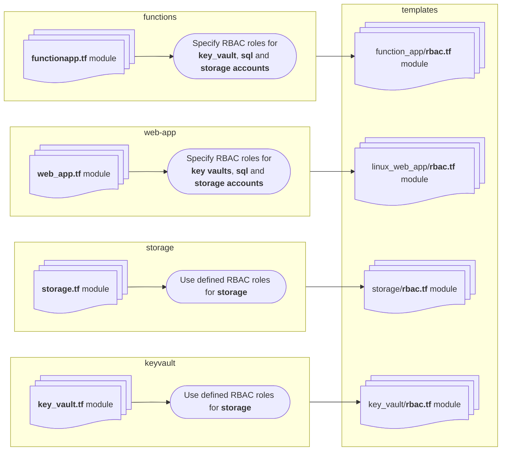

# Project Infrastructure Modules Guidance

## Table of Contents

- [Role Based Access Control](#role-based-access-control)

---

## Role Based Access Control

The module `rbac.tf` centralises handling of global role based assignments for infrastructure resources in this project. While this is not the _only_ approach to handling roles and permissions, its aim is to help developers better manage access control.

There are two approaches to handling access control in this project's Terraform:

- The _current_ approach. This approach uses `rbac.tf` modules with each resource module located in `devops-templates/infrastructure/modules/xxx`
- An alternative approach which uses one or more _"global" role definitions_ that contain all necessary permissions for a given resource.

### Why custom role definitions?

The current security posture prevents the creation of _security groups_. Therefore a similar concept is found using _custom role definitions_. With this approach, we create a single definition that merges the default (least-privilege) permissions, and use the role together with a managed identity to assign to resources like `Key Vault`, `Storage Account`, `SQL Server` and `Function Apps`.

### High-level overview

#### Flow using Custom Roles

Is this supported? ✅
How? Do not specify any `rbac_roles` and ensure you set the `var.use_global_rbac_roles` to `true`.

After the roles are assigned to the new "global" identity, the assignments in the Azure Portal will look similar to the following:

| Role                          | Resource Name                                 | Resource Type    | Principal                        |
|-------------------------------|-----------------------------------------------|------------------|----------------------------------|
| Contributor                   | sbmj-uks-manage-nems-subscription             | App Service      | mi-cohort-manager-global-uksouth |
| Contributor                   | sbmj-uks-delete-participant                   | App Service      | mi-cohort-manager-global-uksouth |
| Contributor                   | sbmj-uks-create-cohort-distribution           | App Service      | mi-cohort-manager-global-uksouth |
| Contributor                   | sbmj-uks-retrieve-participant-data            | App Service      | mi-cohort-manager-global-uksouth |
| Contributor                   | sbmj-uks-servicenow-cohort-lookup             | App Service      | mi-cohort-manager-global-uksouth |
| Contributor                   | sbmj-uks-file-validation                      | App Service      | mi-cohort-manager-global-uksouth |
| Contributor                   | sbmj-uks-get-validation-exceptions            | App Service      | mi-cohort-manager-global-uksouth |
| mi-global-role-keyvault-sbmj  | KV-COHMAN-SBMJ-UKS                            | Key Vault        | mi-cohort-manager-global-uksouth |
| Contributor                   | sbmj-uks-create-exception                     | App Service      | mi-cohort-manager-global-uksouth |
| Contributor                   | sbmj-uks-process-nems-update                  | App Service      | mi-cohort-manager-global-uksouth |
| mi-global-role-storage-sbmj   | stcohmansbmjuksfilexptns                      | Storage Account  | mi-cohort-manager-global-uksouth |
| Contributor                   | sbmj-uks-transform-data-service               | App Service      | mi-cohort-manager-global-uksouth |

#### Flow using current approach

Is this supported still? ✅
How? Specify the `rbac_roles` and ensure you set the `var.use_global_rbac_roles` to `false`.

