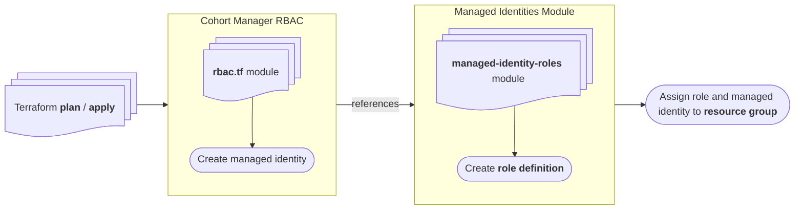
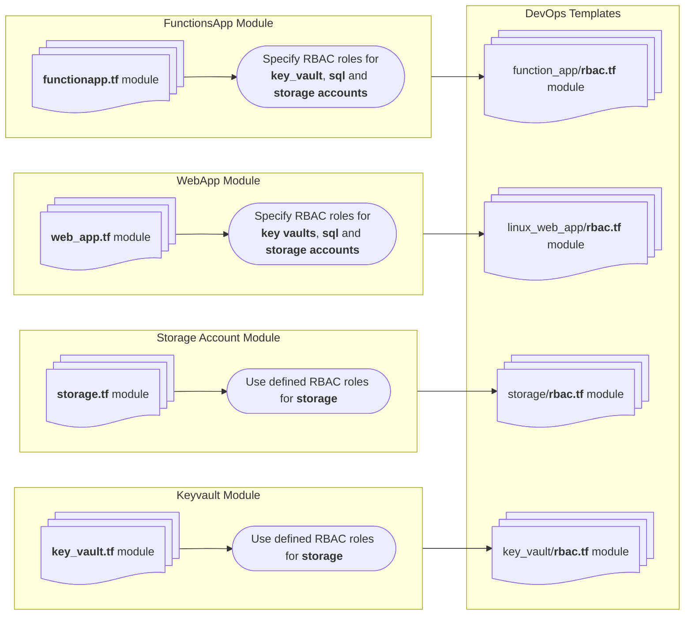

# Project Infrastructure Modules Guidance

## Table of Contents

- [Role Based Access Control](#role-based-access-control)

---

## Role Based Access Control

The module `rbac.tf` centralises handling of global role based assignments for infrastructure resources in this project. While this is not the _only_ approach to handling roles and permissions, its aim is to help developers better manage access control.

> Please note: the centralised approach is commented out due to non-deterministic keys issue with Terraform in the `all_resource_ids`. Using this method is a preferred approach.

There are two approaches to handling access control in this project's Terraform:

- The _current_ approach. This approach uses `rbac.tf` modules located in each resource module folder `devops-templates/infrastructure/modules/xxx`
- An alternative approach that uses a _custom role definition_ with minimal permissions necessary for resource access.

### Why custom role definitions?

The current security posture prevents creation of _security groups_. A similar concept is to use _custom role definitions_.

With this approach, we create a single definition that aggregates multiple permissions, and together with a user assigned managed identity, assigns a single role to the parent group housing all resources like `Key Vault`, `Storage Account`, `SQL Server` and `Function Apps`.

### High-level overview

#### Flow using Custom Role Definition

Is this supported? ✅
How? Do not specify any `rbac_roles` and ensure you set the `var.use_global_rbac_roles` to `true`.

#### How to validate the module

1. After the custom role definition is created and a role assignment attached to the user assigned managed identity, navigate to the Azure IAM blade of the main resource group.

1. Select any relevant resource type in the group, such as SQL Server, Function App, Key Vault, Service Bus Namespace, Storage Account or EventGrid. Navigate to the resource's **IAM** blade.

1. Note that there now exists a role assignment titled **Cohort Manager Custom Role (_env_name_)** for the Cohort Manager User Assigned Identity, scoped to the _resource group_ level.

#### Flow using existing approach

Is this supported still? ✅
How? Specify the `rbac_roles` and ensure you set the `var.use_global_rbac_roles` to `false`.

