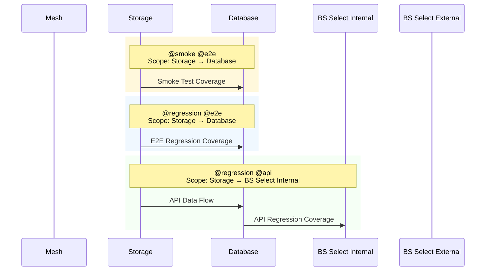

# Functions Testing Guide using Playwright Test Framework

## Prerequisites

- Node.js installed
- Verify all functions are operational

## Running Playwright Tests

### Local Execution

```bash

# Navigate to test framework
cd ../dtos-cohort-manager/tests/playwright-tests
# Install dependencies
npm install
# Run all tests
npm test
# Run specific test file
npx playwright test src/tests/e2e/e2e-with-db.spec.ts

```

### Cloud Execution

Cloud-based test execution is supported in 2 main scenarios:

#### Without Application Code Changes

*(Ad-hoc / Scheduled)*
Focus: Identify outliers (e.g., manual deployments in non-production environments) and ensure test stability, reliability, and transparency.

- Pipeline: `post-deployment-tests-dev.yaml`

#### With Application Code Changes

*(CI/CD)*
Focus: Enable early detection of changes that cause failures, reducing feedback cycles and improving efficiency.

- Pipelines:
  - `acr-image-promote-to-sandbox.yaml`
  - `acr-image-promote-to-dev.yaml`
  - `acr-image-promote-dev-to-nft.yaml`
  - `acr-image-promote-nft-to-integration.yaml`

## Test Flow Overview

1. **File Upload**: Upload test file to storage
2. **Processing**: Local functions process the uploaded file
3. **Validation**: Verify results in cohort using **dynamic** database queries

## Scope of Automation Tests



## Contributing to improve Test Coverage & Framework

- Identify gaps in current test coverage, and or framework
- Create new tests/ utilities following the existing patterns
- Submit pull requests with your improvements
- Document any new test utilities or approaches

## Reusable Components (Steps)

### File Processor

Upload any parquet file to the system by specifying the filename

```ts

// Example usage
async function processFileViaStorage(fileName: string);

```

All test files should be placed under `playwright-tests/tests/e2e/testfiles`

### Validation Engine

```ts

// Example usage
async function validateSqlDatabaseFromAPI(request: APIRequestContext, validations: any);

```

The validation engine accepts a JSON configuration to validate API responses. Below are examples of currently supported formats; more complex scenarios will be added in the future:

- Example Usage 1 – [with meta information for automatic test script generation using runner workflow](../playwright-tests/src/tests/e2e/testFiles/@DTOSS-3217-01/ADD_1B8F53_-_CAAS_BREAST_SCREENING_COHORT.json)
- Example Usage 2 – [multiply input participant records based on unique NHS numbers](../playwright-tests/src/tests/api/testFiles/@DTOSS-5928-01/ADD-10-records-expected.json)
