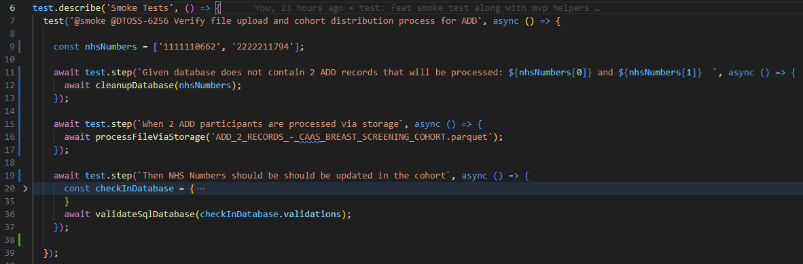
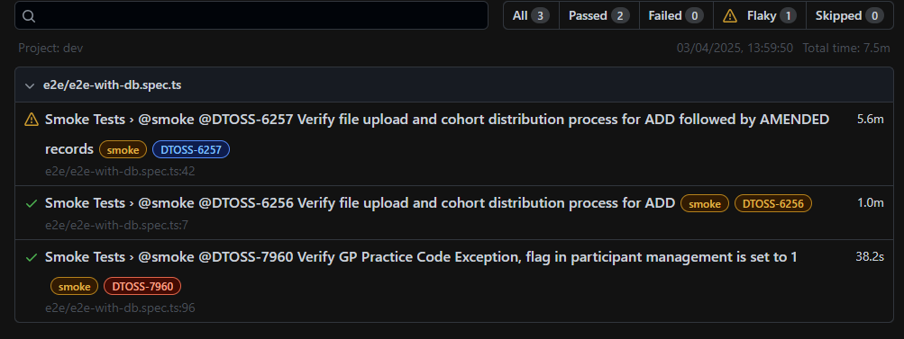
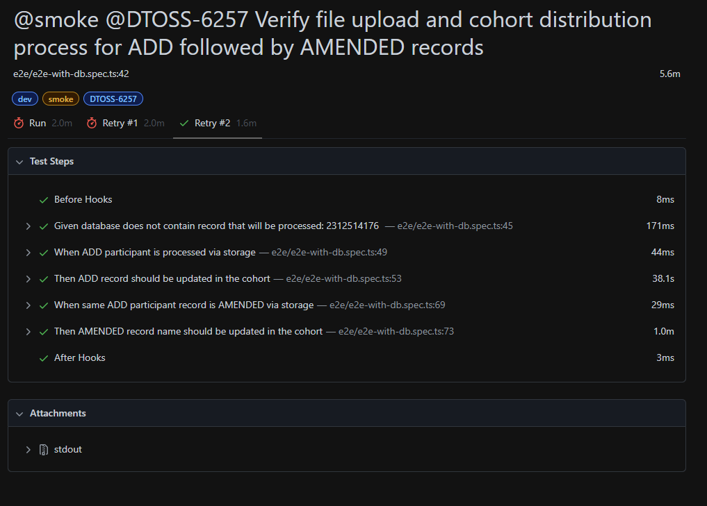
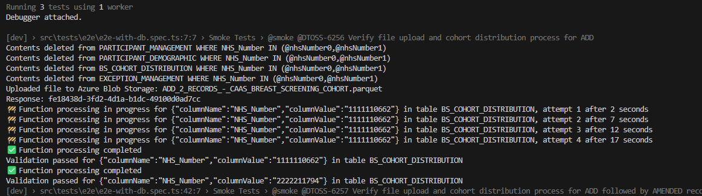

# Functions Testing Guide using Playwright Test Framework

## Prerequisites

- Local functions environment running
- Node.js installed
- Git installed
- VS Code or any preferred IDE
- Verify all functions are operational

## Getting Started

- Follow the setup instructions in the docs located at [Local machine setup](../../docs/user-guides/Local_machine_setup.md) to complete the local setup of functions and dependencies

## Running Playwright Tests

### Local Execution

- Run tests

```bash

# Navigate to test framework
cd ../dtos-cohort-manager/tests/playwright-tests
# Install dependencies
npm install
# Run all tests
npm test
# Run specific test file
npx playwright test src/tests/e2e/e2e-with-db.spec.ts

```

### Cloud Execution

>Note: will be updated soon

## Test Flow Overview

1. **File Upload**: Upload test file to storage
2. **Processing**: Local functions process the uploaded file
3. **Validation**: Verify results in cohort using **dynamic** database queries

### Test Case Scripting Example



### Test Report Example

- report overview



- automatic retries



### Test Logs Example



## Contributing to improve Test Coverage & Framework

- Identify gaps in current test coverage, and or framework
- Create new tests/ utilities following the existing patterns
- Submit pull requests with your improvements
- Document any new test utilities or approaches

## Reusable Components (Steps)

### File Processor

Upload any parquet file to the system by specifying the filename

```ts

// Example usage
async function processFileViaStorage(fileName: string);

```

All test files should be placed under `playwright-tests/tests/e2e/testfiles`

### Validation Engine

```ts

// Example usage
async function validateSqlDatabaseFromAPI(request: APIRequestContext, validations: any);

```

The validation engine accepts a JSON configuration to validate from API response; below are some examples of currently supported formats, more complex scenarios will be added in future

- Example Usage 1

```json

{
  "validations": [
    {
      "validations": {
        "apiEndpoint": "api/CohortDistributionDataService",
        "NHSNumber": 1111110662,
        "PrimaryCareProvider": "E85121",
        "NamePrefix": "MR",
        "GivenName": "NewTest 1",
        "OtherGivenName": "Test",
        "FamilyName": "Adani 1",
        "PreviousFamilyName": "Tester 1",
        "AddressLine5": "United Kingdom",
        "PostCode": "AB43 8FJ",
        "CurrentPosting": "CH",
        "EmailAddressHome": "bturneux0@soup.io",
        "PreferredLanguage": "en",
        "InterpreterRequired": 0
      }
    },
    {
      "validations": {
        "apiEndpoint": "api/CohortDistributionDataService",
        "NHSNumber": 2222211794
      }
    },
    {
      "validations": {
        "apiEndpoint": "api/CohortDistributionDataService",
        "NHSNumber": 2222211794,
        "PrimaryCareProvider": "E85121"
      }
    }
  ]
}


```

- Example Usage 2

```json

{
  "validations": [
    {
      "validations": {
        "apiEndpoint": "api/ExceptionManagementDataService",
        "NhsNumber": "2612314172",
        "RuleId": 36,
        "RuleDescription": "Invalid primary care provider GP practice code"
      }
    }
  ]
}


```

- Example Usage 3

```json

{
  "validations": [
    {
      "validations": {
        "apiEndpoint": "api/ParticipantManagementDataService",
        "NHSNumber": 2612314172,
        "ExceptionFlag":1
      }
    }
  ]
}


```
